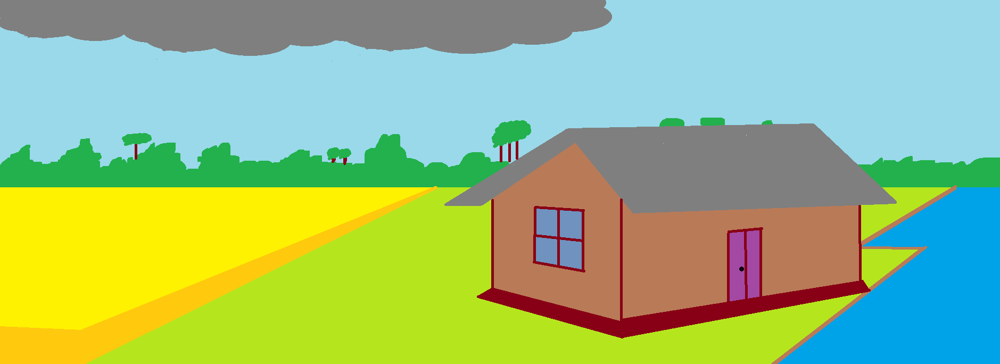
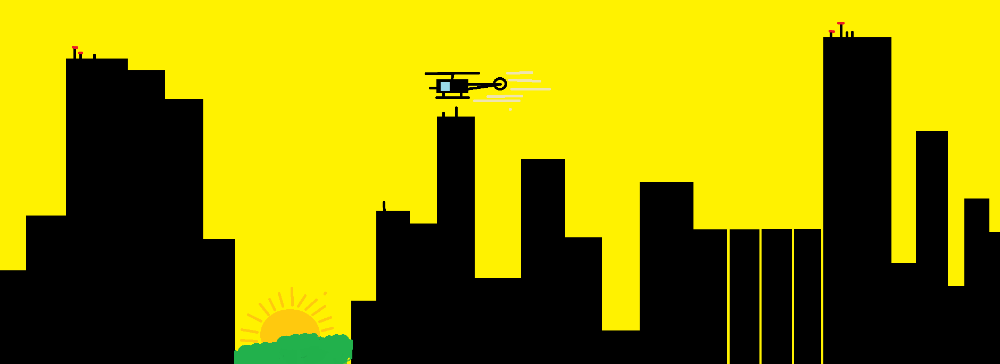
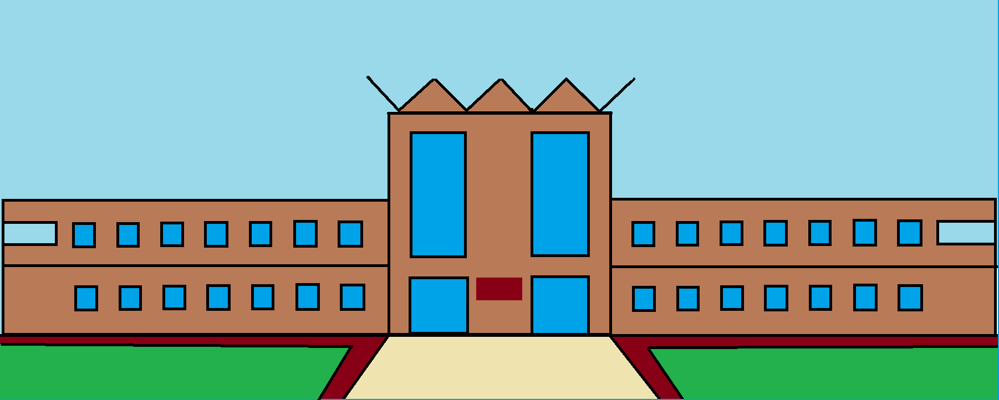
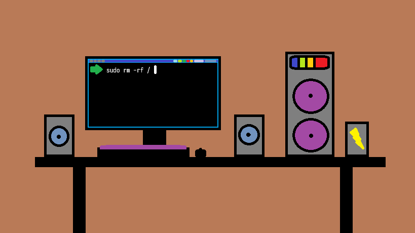

# uiu-code-archive

This repository archives my code from coursework, assignments, and homework at UIU.

---

### I drew this after completing the exams early...

#### ICS ct

#### ICS final

#### SPL ct 1

#### SPL mid

#### SPL ct 2

#### SPL final

